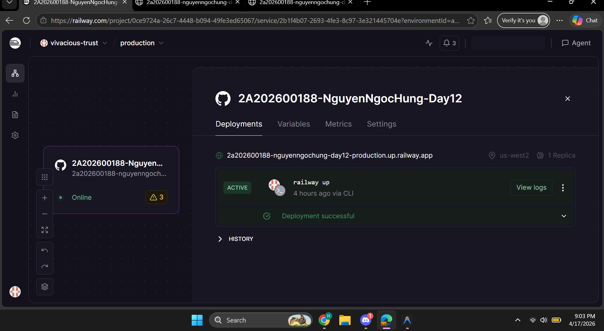
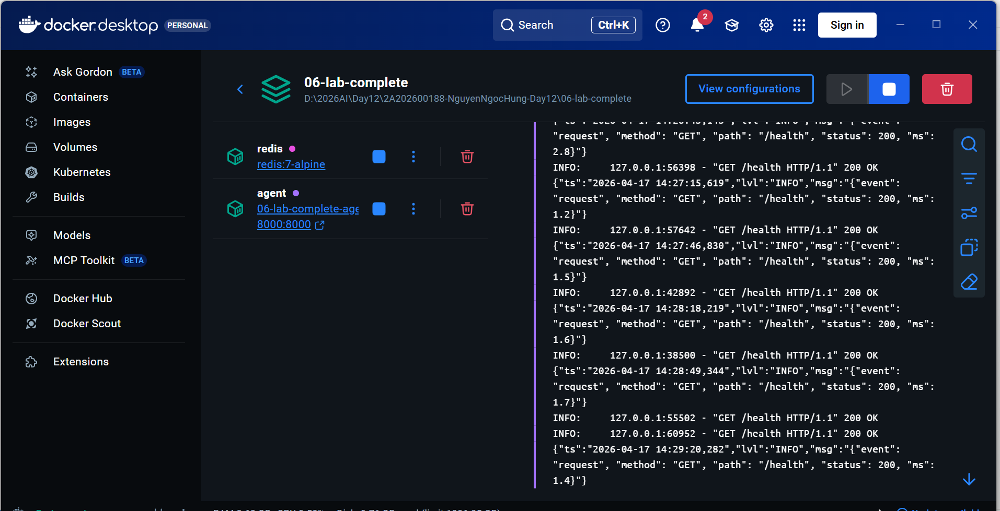
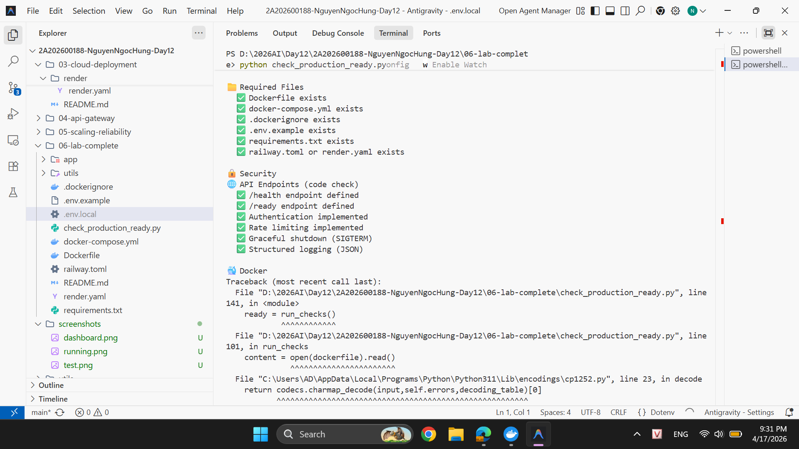

# Deployment Guide — Day 12 AI Agent

This document explains how to deploy your production-ready AI agent to the cloud.

## 🚀 Option 1: Railway (Recommended)

Railway is the fastest way to get your agent online.

### 1. Prerequisites
- [Railway CLI](https://docs.railway.app/guides/cli) installed (`npm i -g @railway/cli`)
- A Railway account (free credits available)

### 2. Steps
1. Navigate to the project folder (e.g., `06-lab-complete` or your integrated folder).
2. Login to Railway:
   ```bash
   railway login
   ```
3. Initialize the project:
   ```bash
   railway init
   ```
4. Deploy the code:
   ```bash
   railway up
   ```
5. Set Environment Variables in the Railway Dashboard:
   - `PORT`: 8000
   - `AGENT_API_KEY`: your-secret-key
   - `REDIS_URL`: (Railway will auto-provide this if you add a Redis service)

### 3. Add Redis Service
In the Railway canvas, click **New** -> **Database** -> **Redis**. Railway will automatically link the `REDIS_URL` to your agent service.

---

## ☁️ Option 2: Render

Render uses a `render.yaml` file (Infrastructure as Code) to manage your stack.

1. Push your code to a GitHub repository.
2. Log in to [dashboard.render.com](https://dashboard.render.com).
3. Click **New** -> **Blueprint**.
4. Connect your GitHub repository.
5. Render will detect `render.yaml` and prompt you to create the resources.
6. Set the `AGENT_API_KEY` in the Environment Variables section.

---

## 🧪 Verification

Once deployed, you can verify your agent using `curl`:

```bash
# Replace <your-url> with your actual public URL
URL="https://your-agent.up.railway.app"
KEY="your-secret-key"

# 1. Health Check
curl $URL/health

# 2. Chat Request
curl -X POST $URL/chat \
     -H "Content-Type: application/json" \
     -H "X-API-Key: $KEY" \
     -d '{"question": "How do I scale an AI agent?"}'
```

---

## 📈 Monitoring & Logs

- **Railway**: View real-time logs in the "Deployments" tab of your project.
- **Render**: View logs in the "Events" and "Logs" tabs.
- **Metrics**: Access the `/metrics` endpoint (if implemented) to see usage statistics.

---

## 🖼 Screenshots

### 1. Deployment Dashboard


### 2. Service Running (Logs)


### 3. API Test Results

